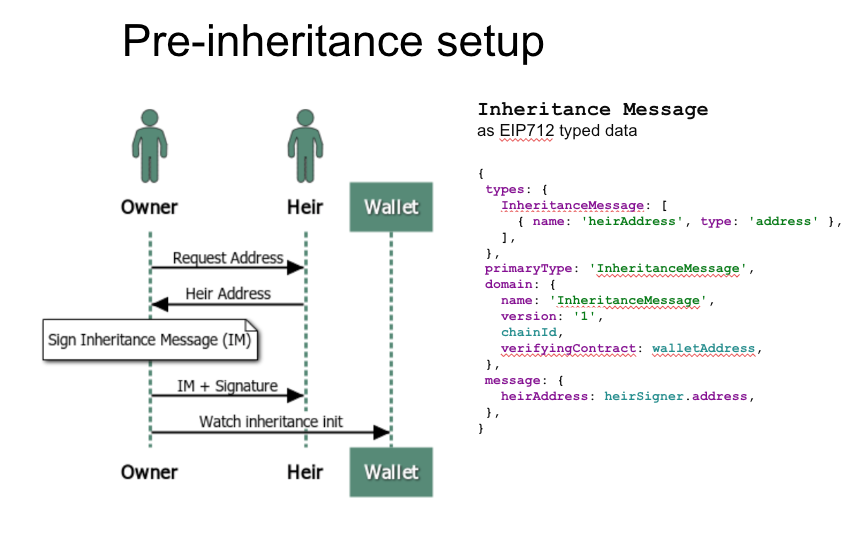
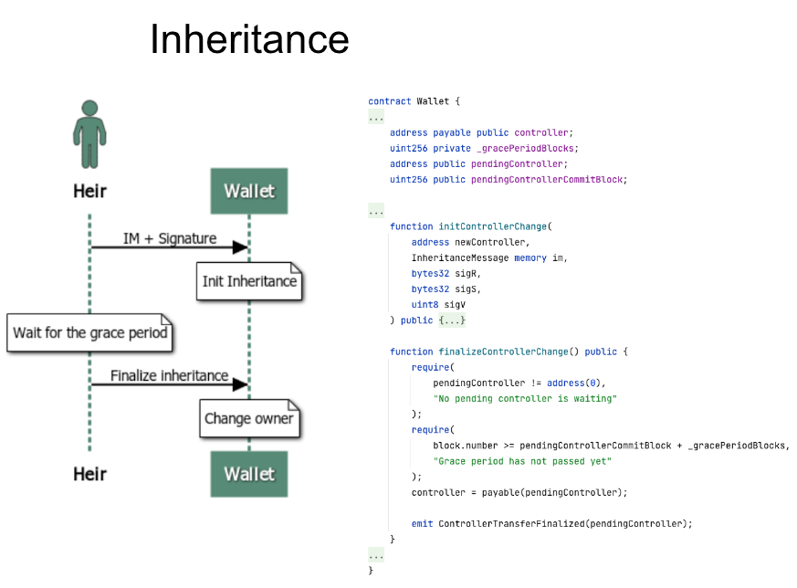
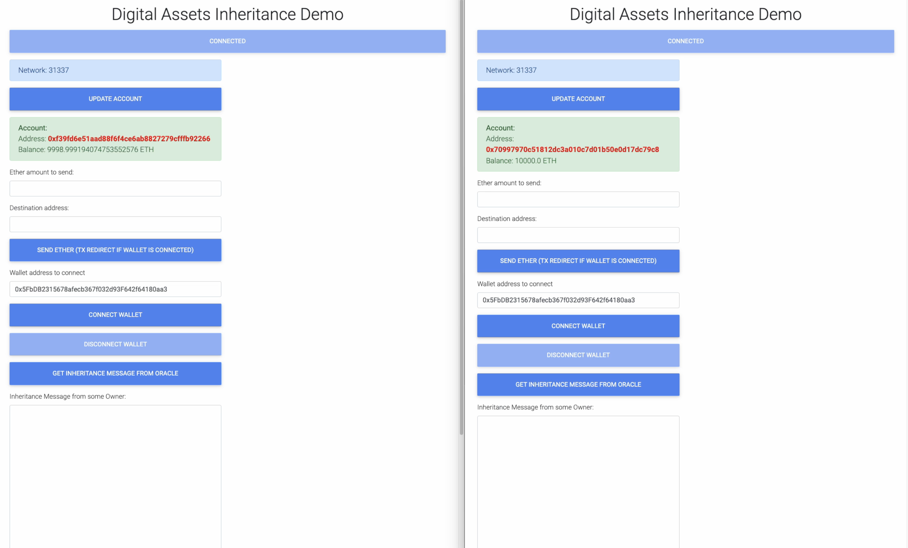

## Purpose

The app represents a Proof-of-Concept of digital assets inheritance protocol. It allows a safe and secure inheritance between self-custody users without any intermediaries.

It is for EVM-based blockchains. The point is that a user keeps Ethers and other digital assets in the Wallet smart contract instead of EOA. Before the inheritance time a user (Owner) will sign and share a special EIP712 signed Typed Data (Inheritace Message) with her Heir.

When the inheritance time comes, the Heir will send the Inheritance Message the wallet smart contract from his EOA, which is one of the attributes of the message. The Wallet controll is transferred to the Heir then after some grace period.





## To run the demo

```
npm run hardhat:node
npm run hardhat:deploy
npm run start:owner
npm run start:heir
```
### Optionally
Build and run the Oracle in the ```dapps/oracle``` folder to simplify the Owner-Heir communication.
Install the browser extension of transactions interseptor, which will forward some transactions to the Wallet smart contract

### Demo video

[](https://youtu.be/8OJOFUVqDZs "Demo video")
